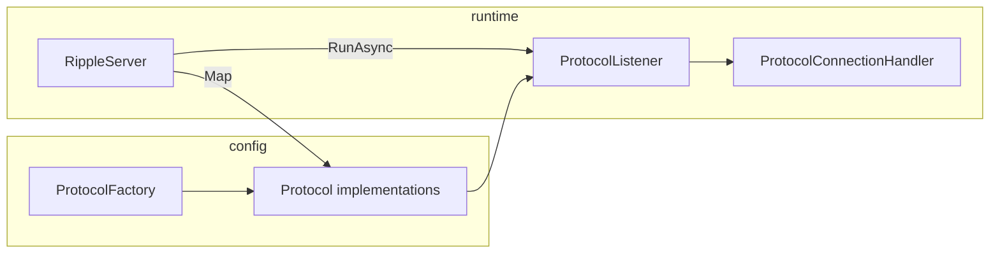

# Architecture

## Purpose

EtherRipple exposes multiple logical **protocols** (HTTP, FTP, IRC, etc.) over TCP. Each protocol implements `IProtocol` (name, port, bind address). Listeners accept connections and hand off bytes according to the protocol implementation.

## Main pieces

| Component | Responsibility |
|-----------|----------------|
| `IProtocol` / `Protocol` | Metadata and binding (`Name`, `Port`, `Address`). |
| `ProtocolExtensions` | URL formatting, `IPEndPoint` construction, fluent `WithAddress` / `WithPort`. |
| `ProtocolListener` | `TcpListener` accept loop; today uses a minimal request/response stub suitable for experiments. |
| `ProtocolFactory` | Central place to construct protocol instances (see implementation). |
| `RippleServer` / `RippleRoute` | `Map(protocol, handler)` registers an endpoint; `RunAsync` listens on all routes concurrently. |
| `ProtocolConnectionHandler` | Per-connection callback: `ValueTask(Stream, IProtocol, CancellationToken)`. |
| `ProtocolHandlers` | Built-ins: `EchoAsync`, `MinimalHttpHtmlAsync`. |
| `Internals/SocketServer` | Lower-level socket hosting when used by the stack. |

## Protocols folder

Concrete types under `Frank.EtherRipple.Server/Protocols/` (for example `HttpProtocol`, `FtpProtocol`) each represent a named port and behavior. Several are stubs or samples; evolve them toward real handshakes and framing as needed.

## SLNX and .NET 10

The solution file `Frank.EtherRipple.slnx` is the supported entry point. Shared MSBuild properties (including `TargetFramework`) live in `Directory.Build.props`.
